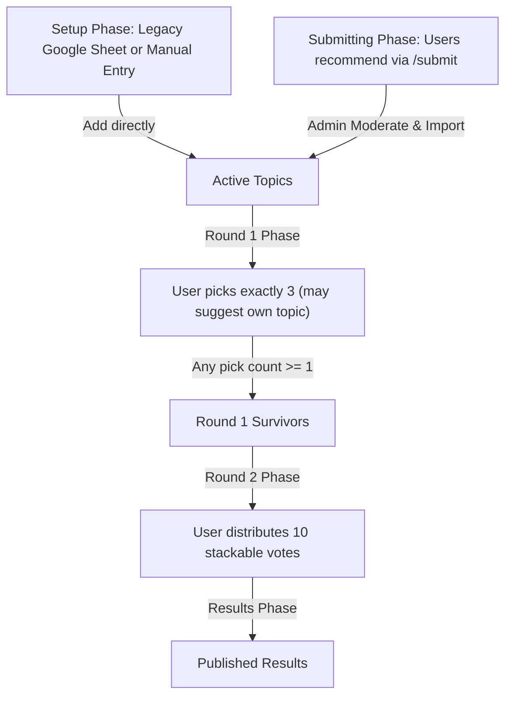
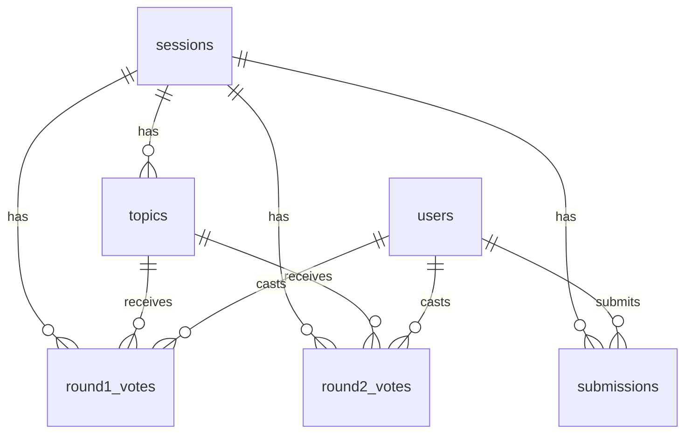

# Music League Topic Voting

A collaborative voting app that allows users to submit topic suggestions, votes on them in two subsequent rounds, and publishes results for the season's Music League prompts.

- **Submissions.** Signed-in users submit topic ideas during this phase up to a configurable cap per user. Admin moderates these submissions, deletes duplicates/noise, and bulk-promotes them into the active topic pool.
- **Round 1 — pick 3.** Signed-in users check exactly three topics they would love to vote songs on. Don't see yours? Suggest your own from the bottom of the ballot — it counts as one of your three picks. Any topic that gets ≥ 1 vote moves forward.
- **Round 2 — spend 10 votes.** Voters distribute exactly 10 stackable votes across Round 1 survivors. Stack all ten on your favorite, or spread them thin — your call. Submitters stay hidden during voting; vote for the idea, and exact wording is settled later.
- **Results.** The top finishers by vote total (with submitters revealed), plus the next ten as "runners up". The admin sets how many leading topics appear on the results page (1–50) from the dashboard; topics with zero votes are hidden from both lists.

One vote per Google account, one admin at a time, phases advanced manually from the admin page.

## Stack

- [Next.js 16 App Router](https://nextjs.org/) (TypeScript, server actions)
- [Supabase](https://supabase.com/) — Postgres, Auth (Google OAuth), RLS
- [@supabase/ssr](https://www.npmjs.com/package/@supabase/ssr) for SSR cookies
- Tailwind v4, zod, papaparse

## How voting flows 



The admin advances each phase manually from the admin page; voters/submitters can edit their entries until each phase closes. Only one session is active at a time; archiving one is a prerequisite for starting the next.

## Data model



- `sessions` — one active at a time (partial unique index on `archived_at IS NULL`); `phase` enum drives gating. Includes `submission_cap` to limit user suggestions.
- `submissions` — holds staging suggestions submitted by users during the `submitting` phase.
- `topics` — imported from the sheet, promoted from `submissions`, **or contributed by a voter from the Round 1 ballot**; `normalized_text` powers duplicate hints; `submitted_by` (nullable FK to `auth.users`) tags voter-contributed rows and is partial-unique per session so each voter has at most one live suggestion.
- `round1_votes` — PK `(user_id, topic_id)`; trigger caps at 3 per user per session. Submission goes through the `submit_round1_ballot` SECURITY DEFINER RPC so the optional user-suggested topic and the three vote inserts share a single transaction.
- `round2_votes` — same PK plus `weight smallint`; trigger caps total weight at 10 and requires the topic to be a Round 1 survivor.

## Local development

```bash
npm install
cp .env.example .env.local   # fill in values (see below)
npm run dev
```

The app reads these environment variables:

| Name                                   | Scope      | Purpose                                 |
| -------------------------------------- | ---------- | --------------------------------------- |
| `NEXT_PUBLIC_SUPABASE_URL`             | public     | Supabase project URL                    |
| `NEXT_PUBLIC_SUPABASE_PUBLISHABLE_KEY` | public     | Publishable API key (browser)           |
| `SUPABASE_SECRET_KEY`                  | **server** | Privileged admin ops — never ship to FE |
| `ADMIN_EMAILS`                         | **server** | Comma-separated list of admin emails    |

`.env.local` is in `.gitignore`. Never check the secret key in.

> The secret key (`sb_secret_...`) is Supabase's current-gen backend
> credential and replaces the legacy `service_role` JWT. Create one in
> **Project Settings → API Keys → Secret keys → Create new secret key**.
> If you already have the legacy `SUPABASE_SERVICE_ROLE_KEY` set, the code
> will keep working — but prefer rotating to the new format.

## Supabase setup

1. **Project**: reuse the existing project or run `supabase projects create`.
2. **Schema**: apply the migration in [`supabase/migrations/0001_init.sql`](supabase/migrations/0001_init.sql) via the Supabase dashboard SQL editor, or with the CLI:
   ```bash
   supabase link --project-ref <ref>
   supabase db push
   ```
3. **Google OAuth**:
   - In the Supabase dashboard → **Authentication → Providers → Google**,
     toggle **Enabled** and paste in Google OAuth Client ID + Secret.
   - In Google Cloud Console → OAuth consent screen, set the app scope to
     `openid`, `email`, `profile`.
   - Add these authorised redirect URIs in Google Cloud:
     - `https://<your-project-ref>.supabase.co/auth/v1/callback`
   - Add these site / redirect URLs in Supabase Auth settings:
     - `http://localhost:3000`
     - `https://<your-production-domain>`
     - `https://<your-production-domain>/auth/callback`
4. **Keep JWT expiry short** (e.g. 1 hour) under Auth → Sessions.

## Admin workflow

1. Set `ADMIN_EMAILS=you@example.com` (comma-separated for multiple admins).
2. Sign in with Google. If no session is active, the landing page shows an
   admin-oriented Google sign-in prompt; once signed in, an **Admin** link
   appears in the navbar.
3. Click **Admin** → **Start session** and give it a name.
4. (Optional) Open **Session Settings** to configure user submission caps, round deadlines, result podium layout, or legacy Google Sheet imports.
5. Click **Open Submissions** to let users suggest topics on `/submit` (they will see a submission count and cap indicator). Review and delete suggestions under the **Topic Submissions Moderation** card, and click **Import all submissions** to copy them into the active topic list.
6. Click **Close submissions → Start Round 1** (triggers a custom warning modal if 0 topics have been added).
7. Voters see `/vote/round1`. Voters can also suggest their own topic at the bottom of the ballot — it slots into the list for everyone else and counts as one of the suggester's 3 picks.
8. When ready, click **Close Round 1 → Open Round 2** (triggers a warning modal if 0 votes have been cast).
9. When ready, click **Close Round 2 → Publish Results**.
10. If needed, **Reopen Round 2** hides results and lets voters edit again.
11. **Archive & Start Fresh** lets you run the next session.

## Security

- Row-Level Security enabled on every public table, with per-user policies
  scoped to `auth.uid()` and the current session phase.
- `sessions`, `topics`, and `submissions` (mutations) are writable only via the Supabase secret key,
  which is gated by `requireAdmin()` (server-side email check against
  `ADMIN_EMAILS`) before any mutating server action runs.
- `auth.jwt()` / `user_metadata` are **never** used for authorisation —
  they're user-editable.
- Results exposed via a `SECURITY DEFINER` function that refuses to return
  rows until the admin flips the session to `results`, so per-user ballots
  remain private even from the results page.
- Topic submitters are hidden from voters during Round 1 and Round 2. The
  Round 2 ballot RPC returns only topic IDs and text; submitters are revealed
  only once results are published.
- Google Sheet fetcher enforces host allowlist, timeout, and a 1 MB cap.
- Admin and voter server actions are rate-limited per user (in-memory token bucket).
- CSP, `X-Frame-Options: DENY`, Referrer-Policy, and Permissions-Policy
  set in [`next.config.ts`](next.config.ts).

## Deploy (Vercel)

1. Push this repo to GitHub and import into Vercel.
2. Add the four env vars above to the Vercel project.
3. After the first deploy, add your Vercel URL as a valid site URL in Supabase Auth → URL Configuration.

## Handy commands

```bash
npm run dev         # local dev
npm run build       # production build
npm run lint        # eslint
npx tsc --noEmit    # typecheck
```

## Project layout

```
src/
  app/            # routes (admin, submit, vote/round1, vote/round2, results, auth)
  components/     # shared UI (BrandMark, BackToHomeLink, GoogleSignInButton)
  lib/            # Supabase clients + domain helpers (session, sheet, pluralize, …)
  proxy.ts        # Next.js 16 proxy — refreshes the Supabase session cookie
supabase/
  migrations/
    0001_init.sql                 # canonical schema: tables, RLS, triggers, RPCs
    0002_user_round1_topics.sql   # adds submitted_by + submit_round1_ballot RPC
    0003_round2_blind_voting.sql  # strips submitter from the Round 2 ballot RPC
    0011_submissions.sql          # adds submissions table, submitting phase, and promote_submissions RPC
```

See [`AGENTS.md`](AGENTS.md) for the full file-by-file breakdown and the
engineering conventions (schema invariants, shared helpers, ballot rules,
security checklist) that aren't obvious from the source.

## License

MIT. See [`LICENSE`](LICENSE) if/when added.
